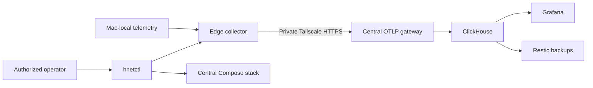

# Service flow

```mermaid
flowchart LR
  operator[Authorized operator] --> hnetctl[hnetctl]
  hnetctl --> edge[Edge collector]
  hnetctl --> central[Central Compose stack]
  source[Mac-local telemetry] --> edge
  edge -->|Private Tailscale HTTPS| gateway[Central OTLP gateway]
  gateway --> clickhouse[ClickHouse]
  clickhouse --> grafana[Grafana]
  clickhouse --> restic[Restic backups]
```

The central services remain private to the trusted network. `hnetctl` is the
operational entry point for starting, inspecting, and backing up the stack.
